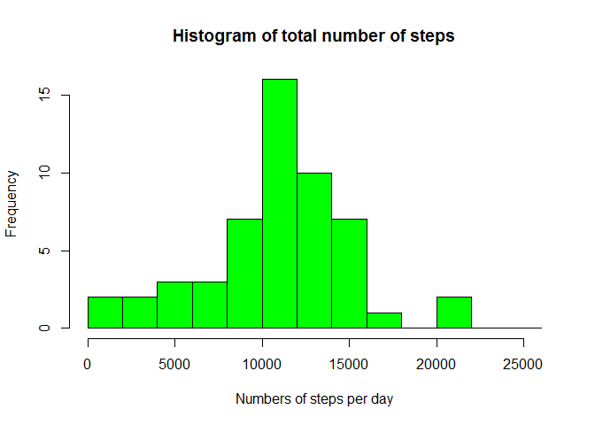
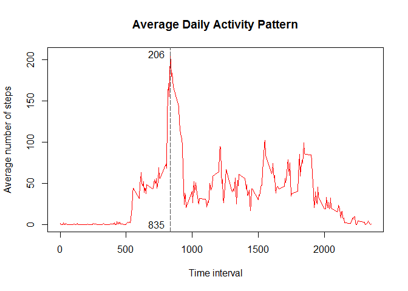
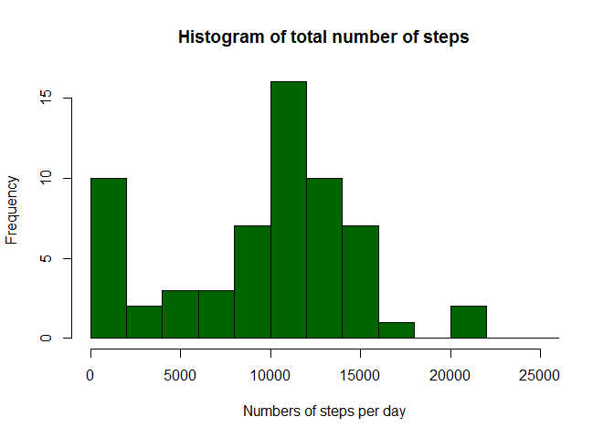
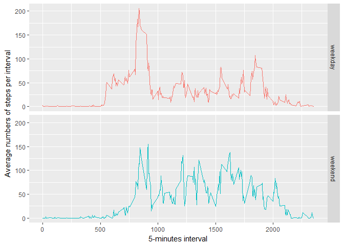

# Reproducible Research: Peer Assessment 1


## Loading and preprocessing the data

We'll use the file from Git repo, cloned to local machine.


```r
#checking what's inside the repo
list.files()
```

```
## [1] "activity.zip"       "doc"                "instructions_fig"  
## [4] "PA1_template.html"  "PA1_template.md"    "PA1_template.Rmd"  
## [7] "PA1_template_files" "README.md"
```

```r
#unzipping the archive
unzip("activity.zip")
#reading csv file
activity <- read.csv("activity.csv", stringsAsFactors = F)
```

Now let's have a look at structure of data frame and how many missing values we have in steps variable


```r
str(activity)
```

```
## 'data.frame':	17568 obs. of  3 variables:
##  $ steps   : int  NA NA NA NA NA NA NA NA NA NA ...
##  $ date    : chr  "2012-10-01" "2012-10-01" "2012-10-01" "2012-10-01" ...
##  $ interval: int  0 5 10 15 20 25 30 35 40 45 ...
```

```r
sum(is.na(activity$steps))
```

```
## [1] 2304
```
We see that date is imported as `character` class, so it needs to be converted to proper format


```r
activity$date <- as.Date(activity$date, format = '%Y-%m-%d')
```

We're set for further exploration, let's move on to the next step.


## What is mean total number of steps taken per day?

As asked, let's plot the histogram of total number of steps. But first we need to summarise steps per day.


```r
#just takin a glance at how table looks like
head(activity)
```

```
##   steps       date interval
## 1    NA 2012-10-01        0
## 2    NA 2012-10-01        5
## 3    NA 2012-10-01       10
## 4    NA 2012-10-01       15
## 5    NA 2012-10-01       20
## 6    NA 2012-10-01       25
```

```r
library(dplyr)
```

```
## 
## Attaching package: 'dplyr'
```

```
## The following objects are masked from 'package:stats':
## 
##     filter, lag
```

```
## The following objects are masked from 'package:base':
## 
##     intersect, setdiff, setequal, union
```

```r
steps_daily <- aggregate(steps ~ date, data = activity, sum, na.action = na.omit)

hist(steps_daily$steps,
     main = 'Histogram of total number of steps', 
     xlab = 'Numbers of steps per day', 
     breaks = seq(0,26000,2000), 
     col = 'green')
```

<!-- -->

Next we would need to find mean and median number of total steps per day, ignoring missing values.


```r
# removing scientific notation in options for readability
options(scipen = 900)
avg <- mean(steps_daily$steps, na.rm = T); med <- median(steps_daily$steps, na.rm = T)
```

So the average number of steps is 10766.19,  and median is 10765.


## What is the average daily activity pattern?

Let's again use base plotting system for our next chart.


```r
avg_daily <- aggregate(steps ~ interval, data = activity, mean)

plot(avg_daily$interval, avg_daily$steps,
     main = 'Average Daily Activity Pattern',
     xlab = 'Time interval',
     ylab = 'Average number of steps',
     type = 'l',
     col = 'red')
abline(v = avg_daily[which.max(avg_daily$steps),]$interval, lty = 5, col = 'grey30')
text(avg_daily[which.max(avg_daily$steps),]$interval, 
     avg_daily[which.max(avg_daily$steps),]$steps, 
     round(avg_daily[which.max(avg_daily$steps),]$steps),
     pos = 2)
text(avg_daily[which.max(avg_daily$steps),]$interval, 
     0, 
     avg_daily[which.max(avg_daily$steps),]$interval,
     pos = 2)
```

<!-- -->

It can be seen from plot that peak is at 835th interval at average of 206 steps.

## Imputing missing values

We have already checked the missing values when looking at the structure of data set, but we'll repeat it again here


```r
sum(is.na(activity$steps))
```

```
## [1] 2304
```

Now, let's impute the missing values. As it was mentioned in task, we don't need a sophisticated method for that, so we'll go by replacing `NA` with mean of each 5 minute interval.


First, let's look how many days contain missing values.

```r
unique(activity$date[is.na(activity)])
```

```
## [1] "2012-10-01" "2012-10-08" "2012-11-01" "2012-11-04" "2012-11-09"
## [6] "2012-11-10" "2012-11-14" "2012-11-30"
```

So for 8 days we have the missing values, that's interesting. We may also go by finding median number of steps for each day and impute missing ones, but we'll stick to our initial goal of going by time interval.


```r
#compute median steps count for each interval
median_imp <- activity %>%
                    group_by(interval) %>%
                    summarise(median_steps = median(steps, na.rm = T))
#replacing NAs by matching intervals
for (i in 1:nrow(activity)) {
  if (is.na(activity$steps[i])) {
  activity$steps[i] <- median_imp$median_steps[which(activity$interval[i] == median_imp$interval)]
  }
}
# Checking if NAs are still present
sum(is.na(activity))
```

```
## [1] 0
```

Now we are ready to recreate the first histogram and compute mean and median again on clean dataset.


```r
steps_daily_2 <- aggregate(steps ~ date, data = activity, sum, na.action = na.omit)

hist(steps_daily_2$steps,
     main = 'Histogram of total number of steps', 
     xlab = 'Numbers of steps per day', 
     breaks = seq(0,26000,2000), 
     col = 'darkgreen')
```

<!-- -->

It can be seen that after median imputation there is an increase in count of smaller number of steps. Let's check how did it affect mean and median values.


```r
cat('Mean number of steps per day after imputation is:',mean(steps_daily_2$steps))
```

```
## Mean number of steps per day after imputation is: 9503.869
```

```r
cat('Median number of steps per day after imputation is:',median(steps_daily_2$steps))
```

```
## Median number of steps per day after imputation is: 10395
```

We can conclude that after imputing missing values with median for each 5 minute interval, distribution looks more skewed, and that is confirmed by shifts in mean and median values, that is mean < median which means that distribution of steps per day is left skewed (or negative).


## Are there differences in activity patterns between weekdays and weekends?

As per assignment task, let's create factor variable indicating `weekday` or `weekend` day and plot timeseries of average number of steps per interval.


```r
day_data <- activity %>%
        mutate(day_ind = factor(ifelse(!weekdays(date) %in% c("Saturday","Sunday"), 'weekday', 'weekend')))

agg_day <- aggregate(steps ~ interval + day_ind, data = day_data, mean)

library(ggplot2)
ggplot(agg_day, aes(interval, steps, color = day_ind)) +
  geom_line()+
  facet_grid(day_ind ~.)+
  labs(x= '5-minutes interval', y = 'Average numbers of steps per interval')+
  theme(legend.position  = 'none')
```

<!-- -->

From chart above generally we can see some similarities in activities performed on weekdays and weekends, but at closer look there's still some inconsistency in 5-minute intervals.


